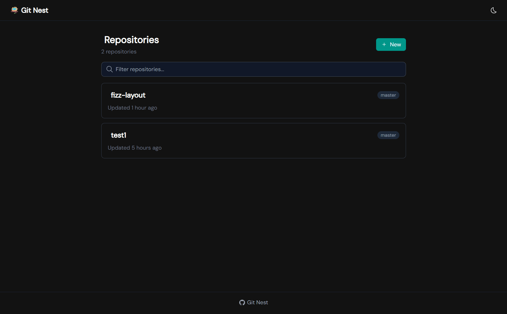
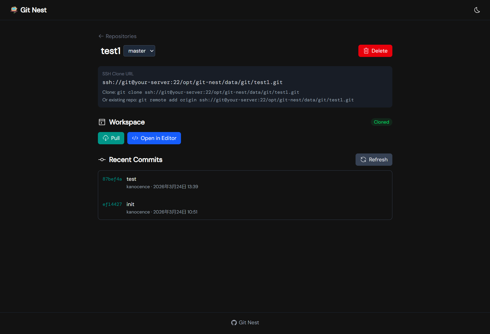
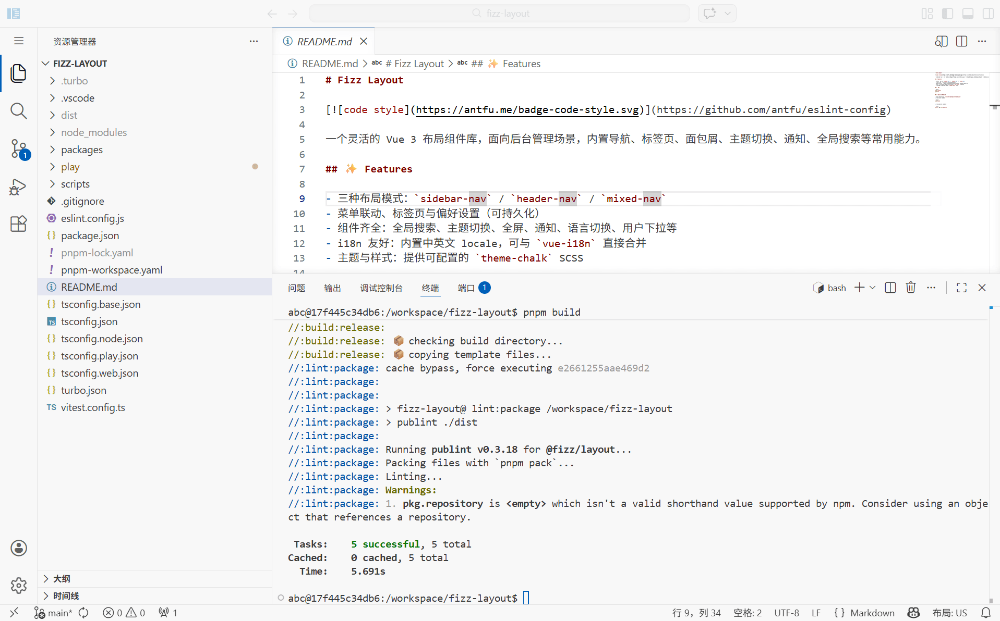

# Git Nest 🪺

轻量级 Git 仓库管理系统。

适用场景：
- 小团队协作开发，使用 Web UI 管理权限和仓库
- 个人开发者在 VPS/NAS 上管理代码仓库
- 同步工作电脑内容，回家后通过 Web UI 访问和编辑

## 核心理念

基于 Docker Compose 部署，提供 Nuxt.js Web 界面管理 bare 仓库，集成 code-server 实现在线编辑。

**权限分离**：Nuxt 前端只做授权与调度，所有 git/文件操作由受限的 `git-runner` sidecar 容器以 `git` 用户身份执行。SSH push/pull 走传统 git 协议，Web 界面负责管理与可视化。

## 架构

```
┌──────────────────────────────────────────────────────────┐
│                     Docker Compose                       │
│                                                          │
│  ┌──────────────┐   HTTP (internal)   ┌───────────────┐  │
│  │   nuxt-app   │ ─────────────────>  │  git-runner   │  │
│  │  (Web UI +   │                     │  (Go sidecar) │  │
│  │  Server API) │ ─────────────────>  │     agent     │  │
│  └──────┬───────┘   HTTP (internal)   │   (Node.js)   │  │
│         │ :3000                       └───────┬───────┘  │
│         │                         ┌───────────┤          │
│  ┌──────┴───────┐            /data/git   /data/workspace │
│  │  code-server │                 │           │          │
│  │   (可选)     │─────────────────┘───────────┘          │
│  └──────┬───────┘                 /data/agent-state      │
│         │ :8443                                          │
└─────────┴────────────────────────────────────────────────┘
                         │
              SSH (git@host) push/pull
                         │
                    ┌────┴────┐
                    │  开发者  │
                    └─────────┘
```

## 系统截图







## 服务组件

| 服务 | 说明 | 技术栈 | 端口 |
|------|------|--------|------|
| **nuxt-app** | Web UI + Server API，负责授权调度 | Nuxt 4 + Nitro | 3000 |
| **git-runner** | 执行 git 操作的受限后端 | Go | 内部 3001 |
| **agent** | AI 任务发现、YAML 校验、执行器调度与 run 持久化 | Node.js | 内部 3002 |
| **code-server** | 在线代码编辑器（可选） | code-server | 8443 |

## AI Agent

Git Nest 内置可选的 AI Agent 服务，用于在共享 workspace 中自动执行任务。它通过仓库中的 `.git-nest/tasks/*.yaml` 文件定义工作流，支持多角色节点（PM、Developer、Reviewer、Tester）和 DAG 边条件控制。

### 核心能力

- **任务发现与校验**：自动扫描 `.git-nest/tasks/*.yaml`，校验节点、边、角色、条件和 DAG 无环性
- **执行器模式**：仅支持 `goose`，通过 Goose CLI 调用真实 LLM API
- **完整任务生命周期**：从启动、排队、运行、验收，到完成/失败/等待审批的完整闭环
- **人工审批与恢复**：支持 `waiting_approval` 状态的 Approve/Reject，以及 `system_interrupted` 状态的重试
- **实时事件流**：通过 SSE 推送执行日志、节点进度和状态变更，Web 端可实时观测
- **工作区管理**：自动准备 workspace、切换任务分支，并在完成后自动 commit/push
- **占用释放**：对 `running`/`queued`/`preparing` 状态的 run 提供 Release 操作，用于解除工作区锁或发送取消信号

### 相关入口

- **仓库页 AI Tasks 面板**：浏览有效任务、查看 workspace 状态、启动 run
- **全局 `/tasks` 页面**：查看所有 run 列表和当前状态
- **Run 详情页**：实时 SSE 事件流、执行历史、节点输出、审批/重试/释放操作

更多详情请参考 [docs/zh/ai-agent.md](docs/zh/ai-agent.md) 和 [docs/zh/user-guide.md](docs/zh/user-guide.md)。

## 快速开始

### 前置条件

- Docker & Docker Compose
- 宿主机上已创建 `git` 用户（用于 SSH push/pull）
- 已初始化 `/data/git`、`/data/workspace`、`/data/agent-state` 目录

### 部署

```bash
# 克隆项目
git clone <repo-url> git-nest && cd git-nest

# 配置环境变量
cp .env.example .env
# 编辑 .env 设置 PUID/PGID 等

# 启动服务
docker compose up -d
```

### 本地开发

```bash
# 前端开发
cd web && pnpm install && pnpm dev

# git-runner 开发 (需要 Go 1.21+)
cd runner && go run .

# agent 开发 (需要 Node.js 20+)
cd agent && pnpm install && pnpm dev
```

## 安全要点

1. **白名单执行**：git-runner 仅接受预定义的 git 命令，拒绝任意 shell 执行
2. **仓库名校验**：只允许 `[a-z0-9_.-]+`，防止路径穿越攻击
3. **内部网络隔离**：git-runner 和 agent 均不对外暴露端口（agent 的 3002 为可选外暴露），核心 API 仅接受 Docker 内部网络请求
4. **API 认证**：git-runner 和 agent 均使用 shared secret 认证，防止未授权访问
5. **超时与限流**：所有操作设置执行超时，agent 执行器也有最大轮数和总超时限制
6. **共享 workspace 约束**：AI 运行期间不建议人工同时修改同一目录，避免变更冲突
7. **日志审计**：记录所有通过 Web 触发的操作

## 相关文档

- [docs/zh/deployment.md](docs/zh/deployment.md) — 部署和运维手册（服务器部署、环境配置、故障排查）
- [docs/zh/user-guide.md](docs/zh/user-guide.md) — 使用手册（Web UI、SSH、Code Server、AI 任务面板）
- [docs/zh/ai-agent.md](docs/zh/ai-agent.md) — AI Agent 当前实现、YAML 结构、API、共享 workspace 规则与限制
- [AI-PLAN.md](AI-PLAN.md) — AI Agent V1 设计方案与目标范围
- [web/README.md](web/README.md) — 前端开发说明（技术栈、本地开发、API 路由规范）

## License

[MIT](LICENSE)
